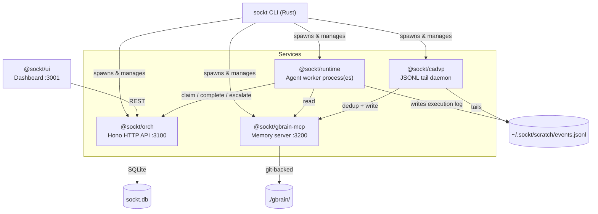
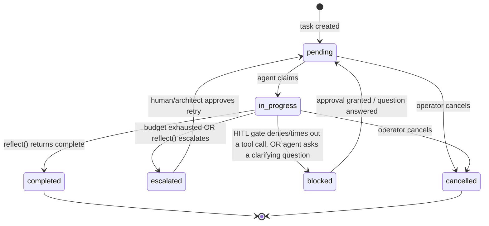
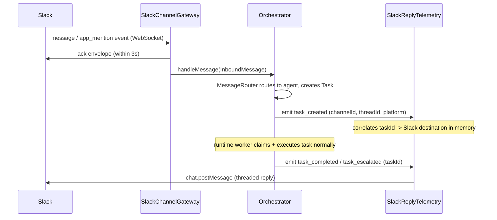
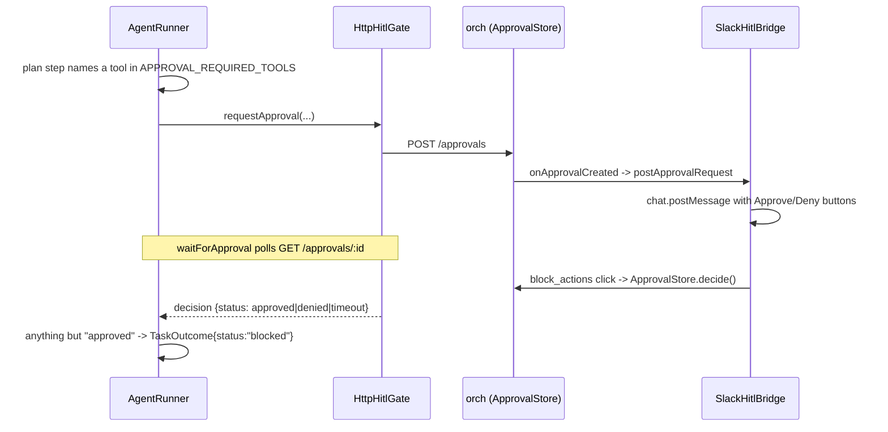
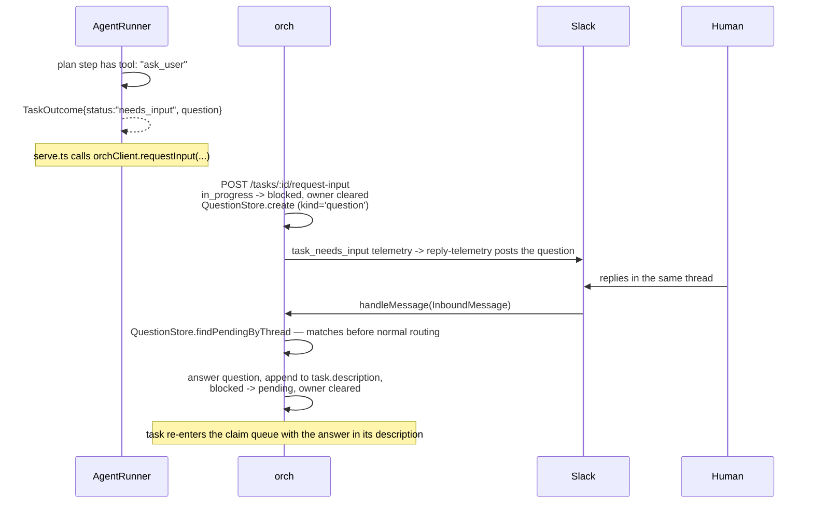

# Architecture

This document explains how Sockt's pieces fit together: the six TypeScript
packages, the GBrain memory server, and the Rust CLI. If you're contributing
code, read this first — [CONTRIBUTING.md](../CONTRIBUTING.md) covers dev
workflow, this covers *why the system is shaped the way it is*.

## What Problem This Solves

Multi-agent LLM systems fail in production for three recurring reasons:

1. **Runaway loops** — an agent gets stuck reasoning in circles, burning API
   calls with no bound
2. **Memory loss** — every task starts from zero; agents re-learn the same
   lessons every run
3. **Credential leakage** — API keys and secrets end up in an LLM's context
   window, one prompt injection away from exfiltration

Sockt's answer to each:

1. A **finite state machine** with a hard LLM-call budget per task — hit the
   cap, auto-escalate, never loop
2. An **async memory pipeline** (CADVP → GBrain) that agents read from but
   never write to directly — keeps the hot path fast and injection-resistant
3. **Encrypted secrets at rest** (age/X25519) and **Docker AI Sandbox**
   isolation for code execution — see [SECURITY.md](../SECURITY.md) for the
   current boundary of that protection

## System Overview

Everything below `Services` can also be run directly with `bun run
packages/<pkg>/src/serve.ts` for local development — the CLI is a convenience
wrapper that manages process lifecycle, health checks, and encrypted config.

## The TypeScript Packages

| Package | Responsibility | Depends on |
|---|---|---|
| `@sockt/types` | Shared Zod schemas, TS interfaces, error classes | — (root of the dependency graph) |
| `@sockt/fsm` | Task state machine, SQLite store, budget guard | `types` |
| `@sockt/memory` | Vector search, dedup, MCP brain client | `types` |
| `@sockt/orch` | Orchestrator HTTP API, agent registry, department templates | `types`, `fsm`, `slack-gateway` |
| `@sockt/runtime` | Agent execution loop, built-in tools, LLM client | `types` |
| `@sockt/cadvp` | JSONL tail daemon, event dedup, memory ingestion | `types`, `memory` |
| `@sockt/gbrain-mcp` | Local MCP memory server | `types` |
| `@sockt/slack-gateway` | `ChannelGateway` implementation over Slack Socket Mode | `types` |
| `@sockt/ui` | React control-plane dashboard | (calls orch over HTTP, no direct import) |

`types` is the only package every other package depends on. No package
imports another's internals — cross-package communication goes through
`types`-defined interfaces (`TaskStore`, `MemoryStore`, `LlmClient`, `Sandbox`)
or over HTTP (orch's REST API).

## Task Lifecycle (the FSM)

Every unit of work is a `Task`, tracked in SQLite, moving through a strict
state machine:

Transitions are enforced in `packages/fsm/src/fsm/engine.ts` — an agent
cannot skip states or resurrect a cancelled task. The **budget guard** lives
alongside this: every task has `llmCallsBudget` and `llmCallsUsed`. Each LLM
call increments the counter (`POST /tasks/:id/record-llm-call`); when
`llmCallsUsed >= llmCallsBudget`, the FSM force-transitions the task to
`escalated` — the single most important anti-runaway mechanism in the system.

## Agent Execution Loop

Each `runtime` process polls the orchestrator for pending tasks, claims one,
and runs it through four phases (`packages/runtime/src/runner/`):

- **Plan** — asks the LLM for a numbered list of steps, budget-aware (it's
  told exactly how many steps it can afford given `budgetRemaining`)
- **Act** — executes a step, either via a registered tool
  (`packages/runtime/src/tools/built-in/`) or a direct LLM call
- **Observe** — records the result into the execution trace
- **Reflect** — asks the LLM whether the task is done, needs another loop, or
  should escalate. If `budgetRemaining <= 1`, the runner **skips reflect
  entirely** and force-completes with the last observation — this prevents
  the classic failure mode where reflect says "not done yet," a second
  attempt starts, and it immediately blows the budget on step one.

Every phase writes to an `ExecutionTrace`
(`packages/runtime/src/trace/execution-trace.ts`), which is what CADVP later
reads from the JSONL log.

## Built-in Tools

Registered in `packages/runtime/src/tools/built-in/index.ts`, available to
any agent whose `AgentConfig.tools` list includes them:

| Tool | What it does | Isolation |
|---|---|---|
| `web_search` | Brave Search (if `BRAVE_SEARCH_API_KEY` set) or DuckDuckGo fallback | — |
| `write_file` / `read_file` | I/O against the agent's scratch directory | — |
| `http_request` | Generic HTTP fetch, e.g. for CRM/ticketing APIs | Basic SSRF guard (see [SECURITY.md](../SECURITY.md)) |
| `create_task` | Creates a subtask on the orchestrator with `parentId` set — this is how architect agents delegate | — |
| `exec_code` | Runs Python/JS/TS/Bash | **Docker AI Sandbox** microVM if `sbx` installed+logged in, otherwise unsandboxed temp dir with a warning — or a hard refusal if `EXEC_CODE_REQUIRE_SANDBOX=true` (default for `engops`); gated by `APPROVAL_REQUIRED_TOOLS` for `engops` by default — see [Human-in-the-Loop](#human-in-the-loop-hitl) |
| `ask_user` | Not a real action — short-circuits the run and asks the human a clarifying question instead of guessing. See [Human-in-the-Loop](#human-in-the-loop-hitl) | — |

## Memory Pipeline (CADVP → GBrain)

Agents don't write to memory directly — that would make prompt injection a
direct path to persistent memory poisoning. Instead:

1. Every phase of every task execution appends a line to
   `~/.sockt/scratch/events.jsonl`
2. `@sockt/cadvp` tails that file (`JsonlTailer`), batches new events, and
   deduplicates them against existing memory using cosine similarity
   (default threshold `0.92`)
3. Non-duplicate events are written to `@sockt/gbrain-mcp`, a local SQLite +
   git-backed knowledge store
4. On the next task, the runtime's `SkillCompiler` queries GBrain for
   relevant prior executions and injects them as context

This is also how **skills** work — see [DEPARTMENTS.md](DEPARTMENTS.md) for
the department-specific skill index system, which pre-seeds each department
with `.skill` JSON files (sourced from a curated skills registry) rather than
waiting for the agent to learn them from scratch.

## Orchestrator API

`@sockt/orch` exposes a Hono HTTP server (default port `3100`). Full endpoint
reference: [docs/API.md](API.md). Key groups:

- **Tasks** — create, list, get, patch, claim, complete, escalate, block,
  request-input, cancel, approve, reject, retry, record-llm-call
- **Agents** — register, list, get, deregister (self-registration on
  runtime startup)
- **Approvals** — HITL gate: request, list pending, decide — see
  [Human-in-the-Loop](#human-in-the-loop-hitl)
- **Health** — service status, active agent count, pending task count

The orchestrator has **no built-in authentication** — see
[SECURITY.md](../SECURITY.md#5-the-orchestrator-api-has-no-authentication-by-default)
before exposing it beyond localhost.

## Slack Bridge

`@sockt/types` defines a `ChannelGateway` interface (`onMessage`, `send`,
`listChannels`, `disconnect`) that `Orchestrator` will wire up if you pass
one into its config. `@sockt/slack-gateway` is the implementation, backed
by Slack's Socket Mode API:

Key points:

- **Inbound** goes over an outbound-only WebSocket (Socket Mode) — no public
  HTTP endpoint or ingress required
- **Outbound** replies use Slack's normal Web API (`chat.postMessage`) —
  Socket Mode is receive-only
- **Inbound events are deduplicated** on `channel:ts` before ever reaching the
  message handler (`SlackChannelGateway`, a capped 500-entry FIFO — see
  `isDuplicateEvent` in `packages/slack-gateway/src/gateway.ts`). A workspace
  subscribed to both `message.channels` and `app_mentions:read` gets two
  separate events — a `message` event and an `app_mention` event — for one
  `@sockt` message, both carrying the same `ts`; without this, that alone
  produced two tasks per human send in ~17/20 rows of the first eval pass
  (see [evals/test-plan.md](../evals/test-plan.md)). Does not cover message
  *edits* creating a duplicate task — that's a separate, still-open bug (see
  test-plan.md's M2 probe), since an edit's event carries a different `ts`
  than the original
- The task → Slack-destination correlation is cached in `SlackReplyTelemetry`,
  in memory, keyed by `taskId`, populated from the `task_created` telemetry
  event's `data.channelId`/`data.threadId`/`data.platform` fields (set in
  `Orchestrator.handleMessage`) and consumed on `task_completed`/
  `task_escalated`/`task_blocked`/`task_needs_input`. It's also persisted to
  a `task_origins` SQLite table (`packages/orch/src/store/task-origin-store.ts`)
  at task-creation time — if the in-memory cache misses (e.g. the orchestrator
  restarted mid-task), `SlackReplyTelemetry`'s optional `originLookup` falls
  back to that table, so a restart no longer silently loses the reply. This
  was a confirmed gap in the first eval pass (mechanical probe M3, see
  [evals/test-plan.md](../evals/test-plan.md)) — fixed since
- Enabled automatically by `sockt deploy` once `sockt setup slack` has
  stored encrypted tokens (`~/.sockt/config.yaml`) — see
  [CONFIGURATION.md](CONFIGURATION.md) for the `SLACK_APP_TOKEN`/
  `SLACK_BOT_TOKEN` env vars this resolves to

## Human-in-the-Loop (HITL)

Built directly in response to the first eval pass's biggest finding:
**capability hallucination** — agents confidently claiming to have done
things (sent an email, SSH'd into a box, restarted a service) or answered
underspecified questions ("should we build feature X?") with fabricated
confidence instead of asking. See the "Status update" section at the bottom
of [evals/test-plan.md](../evals/test-plan.md) for the failure rows this
targets (G5, P4, P5, E4, E6, and 4 more).

There are two related but distinct mechanisms, both landing the task in
`blocked` (see the FSM diagram above) until a human acts:

### 1. Tool approval gate

For tools an agent shouldn't be allowed to run unattended (`exec_code` is the
default — see [CONFIGURATION.md](CONFIGURATION.md#runtime-agent-worker)):

- **`ApprovalStore`** (`packages/orch/src/api/approval-store.ts`) is
  SQLite-backed against the shared `pending_human_inputs` table — survives an
  orch restart, unlike the in-memory `Map` it replaced. A 30s sweep
  (`OrchestratorApi`) marks any approval past its `timeoutAt` as `timeout`,
  belt-and-braces with the poller's own client-side deadline.
- **`HttpHitlGate`** (`packages/runtime/src/hitl/http-hitl-gate.ts`) is the
  `HitlGate` implementation a runtime worker uses — polls
  `GET /approvals/:id` every `HITL_POLL_INTERVAL_MS` until a decision or its
  own `HITL_TIMEOUT_MS` deadline.
- **Fail-closed**: anything other than an explicit `"approved"` — denied,
  timeout, or the approval row simply not existing — blocks the tool call.
  A prior version only checked for `"denied"`, which let a client-side
  timeout fall through and run the gated tool anyway.
- **`SlackHitlBridge`** (`packages/orch/src/hitl/slack-hitl-bridge.ts`) posts
  the Block Kit approve/deny message to the thread that triggered the task
  (looked up via `task_origins`) and routes button clicks back to
  `ApprovalStore.decide()`, then edits the message in place to show the
  decision.

### 2. Clarifying questions (`ask_user`)

For when the task genuinely can't proceed without more information — the
`ask_user` pseudo-tool (`packages/runtime/src/tools/built-in/ask_user.ts`) is
listed in the tool registry purely so plan-phase tool-name grounding accepts
it, but `AgentRunner` intercepts it *before* the Act phase (a human's answer
can't be observed within the same run, so there's nothing to execute):

- **`QuestionStore`** (`packages/orch/src/api/question-store.ts`) is the
  question-shaped sibling of `ApprovalStore`, sharing the same
  `pending_human_inputs` table (`kind='question'`) — it stores the
  originating Slack channel/thread at creation time so a later reply can be
  matched back without a second lookup.
- **Thread-reply interception** happens in `Orchestrator.handleMessage`,
  *before* normal message routing: if the message is a threaded reply and
  `QuestionStore.findPendingByThread` finds a match, it's treated as an
  answer, not a new request — otherwise a reply like "staging, please" would
  itself spawn a new (nonsensical) task.
- The answer is appended to the task's `description` (tasks have no separate
  conversation field) so the next Plan phase reads it as part of the task
  context.

## Departments & Multi-Agent Coordination

A **department** (`growth`, `product`, `engops`) is a template:
`packages/orch/src/registry/templates/<name>.ts` returns an array of
`AgentConfig`s — one **architect** (decomposes goals into subtasks via
`create_task`) and one or more **workers** (claim and execute leaf tasks).
Full detail in [DEPARTMENTS.md](DEPARTMENTS.md).

`sockt department add <name>` activates a template; `sockt deploy` spawns
one `runtime` process per configured agent, each polling the orchestrator
independently.

## The Rust CLI

`rust/sockt-cli` is the operator-facing binary. It does not contain business
logic — it's a process manager and thin HTTP client:

- `deploy` / `stop` / `restart` / `destroy` — spawn/manage the Bun processes
  above (or `sbx run` them for sandboxed agents), track PIDs in
  `~/.sockt/runtime.json`
- `status` / `health` / `doctor` — poll the orchestrator's `/health` and
  inspect local process state
- `tasks` / `ask` / `brain` / `department` — thin wrappers around the
  orchestrator's REST API (`src/orch_client.rs`)
- `config` / `secrets` / `setup` — manage `~/.sockt/config.yaml`, encrypted
  with `age`

See [CONTRIBUTING.md](../CONTRIBUTING.md#repository-layout) for where each
command's implementation lives.

## Where the OSS/Paid Boundary Sits

Everything in this repository is licensed under
[FSL-1.1-MIT](../LICENSE.md) — free for non-competing use, converts to MIT
automatically two years after each release. The hosted Sockt platform adds,
on top of this OSS core:

- **GBrain cloud sync** — the local `gbrain-mcp` server here is fully
  functional standalone; the paid tier adds team-shared, multi-device sync
- **TEE credential vaults** — hardware-isolated secret storage beyond the
  local `age`-encrypted file used here
- **Fleet intelligence / cross-deployment analytics** — aggregated
  benchmarking across the hosted customer base

Nothing in this repo phones home or requires the paid tier to function.
