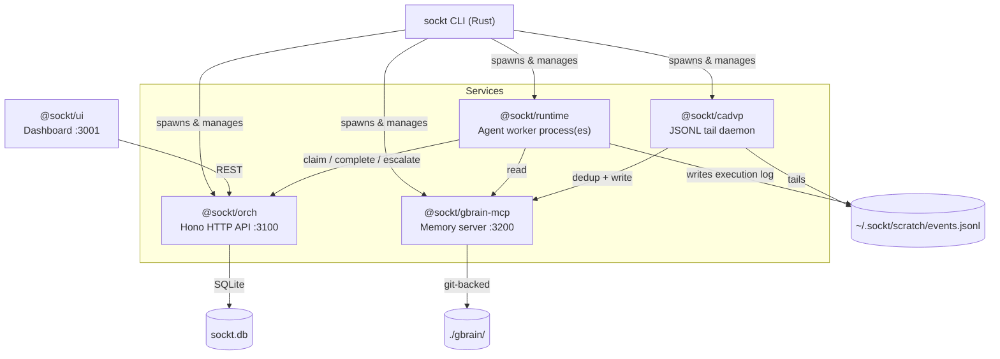
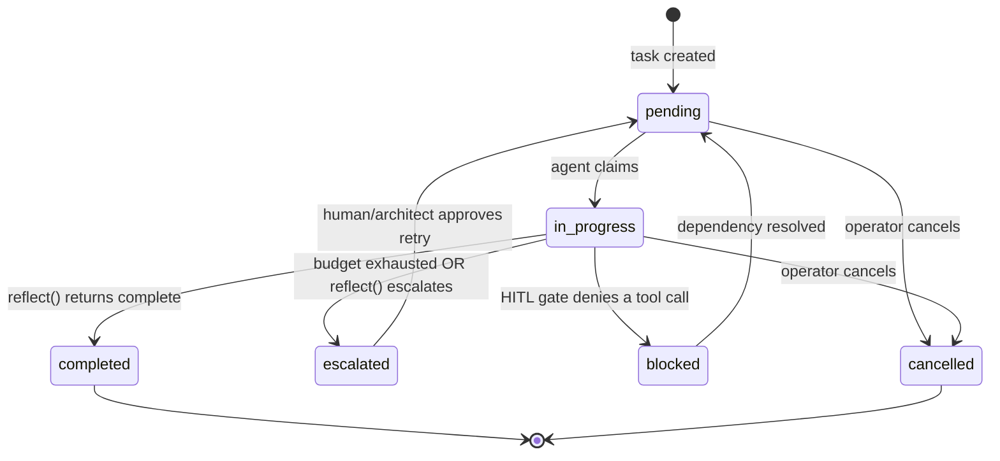

# Architecture

This document explains how Sockt's pieces fit together: the six TypeScript
packages, the GBrain memory server, and the Rust CLI. If you're contributing
code, read this first — [CONTRIBUTING.md](../CONTRIBUTING.md) covers dev
workflow, this covers *why the system is shaped the way it is*.

## What Problem This Solves

Multi-agent LLM systems fail in production for three recurring reasons:

1. **Runaway loops** — an agent gets stuck reasoning in circles, burning API
   calls with no bound
2. **Memory loss** — every task starts from zero; agents re-learn the same
   lessons every run
3. **Credential leakage** — API keys and secrets end up in an LLM's context
   window, one prompt injection away from exfiltration

Sockt's answer to each:

1. A **finite state machine** with a hard LLM-call budget per task — hit the
   cap, auto-escalate, never loop
2. An **async memory pipeline** (CADVP → GBrain) that agents read from but
   never write to directly — keeps the hot path fast and injection-resistant
3. **Encrypted secrets at rest** (age/X25519) and **Docker AI Sandbox**
   isolation for code execution — see [SECURITY.md](../SECURITY.md) for the
   current boundary of that protection

## System Overview

Everything below `Services` can also be run directly with `bun run
packages/<pkg>/src/serve.ts` for local development — the CLI is a convenience
wrapper that manages process lifecycle, health checks, and encrypted config.

## The Six TypeScript Packages

| Package | Responsibility | Depends on |
|---|---|---|
| `@sockt/types` | Shared Zod schemas, TS interfaces, error classes | — (root of the dependency graph) |
| `@sockt/fsm` | Task state machine, SQLite store, budget guard | `types` |
| `@sockt/memory` | Vector search, dedup, MCP brain client | `types` |
| `@sockt/orch` | Orchestrator HTTP API, agent registry, department templates | `types`, `fsm` |
| `@sockt/runtime` | Agent execution loop, built-in tools, LLM client | `types` |
| `@sockt/cadvp` | JSONL tail daemon, event dedup, memory ingestion | `types`, `memory` |
| `@sockt/gbrain-mcp` | Local MCP memory server | `types` |
| `@sockt/ui` | React control-plane dashboard | (calls orch over HTTP, no direct import) |

`types` is the only package every other package depends on. No package
imports another's internals — cross-package communication goes through
`types`-defined interfaces (`TaskStore`, `MemoryStore`, `LlmClient`, `Sandbox`)
or over HTTP (orch's REST API).

## Task Lifecycle (the FSM)

Every unit of work is a `Task`, tracked in SQLite, moving through a strict
state machine:

Transitions are enforced in `packages/fsm/src/fsm/engine.ts` — an agent
cannot skip states or resurrect a cancelled task. The **budget guard** lives
alongside this: every task has `llmCallsBudget` and `llmCallsUsed`. Each LLM
call increments the counter (`POST /tasks/:id/record-llm-call`); when
`llmCallsUsed >= llmCallsBudget`, the FSM force-transitions the task to
`escalated` — the single most important anti-runaway mechanism in the system.

## Agent Execution Loop

Each `runtime` process polls the orchestrator for pending tasks, claims one,
and runs it through four phases (`packages/runtime/src/runner/`):

- **Plan** — asks the LLM for a numbered list of steps, budget-aware (it's
  told exactly how many steps it can afford given `budgetRemaining`)
- **Act** — executes a step, either via a registered tool
  (`packages/runtime/src/tools/built-in/`) or a direct LLM call
- **Observe** — records the result into the execution trace
- **Reflect** — asks the LLM whether the task is done, needs another loop, or
  should escalate. If `budgetRemaining <= 1`, the runner **skips reflect
  entirely** and force-completes with the last observation — this prevents
  the classic failure mode where reflect says "not done yet," a second
  attempt starts, and it immediately blows the budget on step one.

Every phase writes to an `ExecutionTrace`
(`packages/runtime/src/trace/execution-trace.ts`), which is what CADVP later
reads from the JSONL log.

## Built-in Tools

Registered in `packages/runtime/src/tools/built-in/index.ts`, available to
any agent whose `AgentConfig.tools` list includes them:

| Tool | What it does | Isolation |
|---|---|---|
| `web_search` | Brave Search (if `BRAVE_SEARCH_API_KEY` set) or DuckDuckGo fallback | — |
| `write_file` / `read_file` | I/O against the agent's scratch directory | — |
| `http_request` | Generic HTTP fetch, e.g. for CRM/ticketing APIs | Basic SSRF guard (see [SECURITY.md](../SECURITY.md)) |
| `create_task` | Creates a subtask on the orchestrator with `parentId` set — this is how architect agents delegate | — |
| `exec_code` | Runs Python/JS/TS/Bash | **Docker AI Sandbox** microVM if `sbx` installed, otherwise unsandboxed temp dir with a warning |

## Memory Pipeline (CADVP → GBrain)

Agents don't write to memory directly — that would make prompt injection a
direct path to persistent memory poisoning. Instead:

1. Every phase of every task execution appends a line to
   `~/.sockt/scratch/events.jsonl`
2. `@sockt/cadvp` tails that file (`JsonlTailer`), batches new events, and
   deduplicates them against existing memory using cosine similarity
   (default threshold `0.92`)
3. Non-duplicate events are written to `@sockt/gbrain-mcp`, a local SQLite +
   git-backed knowledge store
4. On the next task, the runtime's `SkillCompiler` queries GBrain for
   relevant prior executions and injects them as context

This is also how **skills** work — see [DEPARTMENTS.md](DEPARTMENTS.md) for
the department-specific skill index system, which pre-seeds each department
with `.skill` JSON files (sourced from a curated skills registry) rather than
waiting for the agent to learn them from scratch.

## Orchestrator API

`@sockt/orch` exposes a Hono HTTP server (default port `3100`). Full endpoint
reference: [docs/API.md](API.md). Key groups:

- **Tasks** — create, list, get, patch, claim, complete, escalate, cancel,
  approve, reject, retry, record-llm-call
- **Agents** — register, list, get, deregister (self-registration on
  runtime startup)
- **Approvals** — HITL gate: request, list pending, decide
- **Health** — service status, active agent count, pending task count

The orchestrator has **no built-in authentication** — see
[SECURITY.md](../SECURITY.md#5-the-orchestrator-api-has-no-authentication-by-default)
before exposing it beyond localhost.

## Departments & Multi-Agent Coordination

A **department** (`growth`, `product`, `engops`) is a template:
`packages/orch/src/registry/templates/<name>.ts` returns an array of
`AgentConfig`s — one **architect** (decomposes goals into subtasks via
`create_task`) and one or more **workers** (claim and execute leaf tasks).
Full detail in [DEPARTMENTS.md](DEPARTMENTS.md).

`sockt department add <name>` activates a template; `sockt deploy` spawns
one `runtime` process per configured agent, each polling the orchestrator
independently.

## The Rust CLI

`rust/sockt-cli` is the operator-facing binary. It does not contain business
logic — it's a process manager and thin HTTP client:

- `deploy` / `stop` / `restart` / `destroy` — spawn/manage the Bun processes
  above (or `sbx run` them for sandboxed agents), track PIDs in
  `~/.sockt/runtime.json`
- `status` / `health` / `doctor` — poll the orchestrator's `/health` and
  inspect local process state
- `tasks` / `ask` / `brain` / `department` — thin wrappers around the
  orchestrator's REST API (`src/orch_client.rs`)
- `config` / `secrets` / `setup` — manage `~/.sockt/config.yaml`, encrypted
  with `age`

See [CONTRIBUTING.md](../CONTRIBUTING.md#repository-layout) for where each
command's implementation lives.

## Where the OSS/Paid Boundary Sits

Everything in this repository is licensed under
[FSL-1.1-MIT](../LICENSE.md) — free for non-competing use, converts to MIT
automatically two years after each release. The hosted Sockt platform adds,
on top of this OSS core:

- **GBrain cloud sync** — the local `gbrain-mcp` server here is fully
  functional standalone; the paid tier adds team-shared, multi-device sync
- **TEE credential vaults** — hardware-isolated secret storage beyond the
  local `age`-encrypted file used here
- **Fleet intelligence / cross-deployment analytics** — aggregated
  benchmarking across the hosted customer base

Nothing in this repo phones home or requires the paid tier to function.
